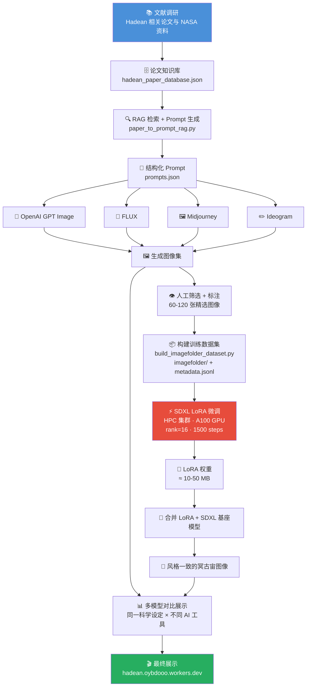

# Hadean Earth AI

使用生成式 AI 创作冥古宙（Hadean Eon）地球图像的项目。

## 展示网站

👉 **[https://hadean.oybdooo.workers.dev/](https://hadean.oybdooo.workers.dev/)**

## 课程信息

本项目是**张少兵**老师 **"早期地球和前寒武纪地质学"** 课程的第一次作业。

### 作业要求

> 请自己设计关键词或脚本，用不同的生成式AI生成冥古宙的地球照片，可以很宏观，也可以很具体。每个人至少试用两种AI工具，下次课前进行展示和讲述。

## Methods

### 整体流程图



### 什么是 LoRA 微调？

**LoRA**（Low-Rank Adaptation）是一种**参数高效微调**方法，核心思想是：

> 不修改预训练大模型的原始权重，而是在模型的注意力层旁边插入一对小的低秩矩阵 $A$ 和 $B$，只训练这对矩阵。

#### 数学原理

原始模型权重矩阵 $W_0 \in \mathbb{R}^{d \times k}$ 在推理时变为：

$$W = W_0 + \Delta W = W_0 + BA$$

其中 $B \in \mathbb{R}^{d \times r}$，$A \in \mathbb{R}^{r \times k}$，$r \ll \min(d, k)$。

- $r$ 就是 **rank**（秩），本项目设为 16
- 原始 SDXL 模型约 6.9B 参数，LoRA 只需训练 **几百万** 参数
- 最终产出的 LoRA 权重文件仅 **10-50 MB**

#### 为什么用 LoRA？

| 对比项 | 全参数微调 | LoRA 微调 |
|--------|-----------|----------|
| 训练参数量 | 数十亿 | 数百万 |
| 显存需求 | 80 GB+ | 24 GB 起步 |
| 训练时间 | 数天 | 数小时 |
| 权重文件大小 | ~13 GB | ~10-50 MB |
| 是否破坏基座能力 | 可能 | 不会 |

#### 本项目的 LoRA 训练配置

```text
基座模型:    stabilityai/stable-diffusion-xl-base-1.0
训练分辨率:  768×768
LoRA rank:  16
批次大小:    1 (梯度累积 4 步 → 等效 batch 4)
学习率:      1e-4
训练步数:    1,500 steps
混合精度:    bf16
调度器:      HPC Slurm (单卡 A100)
```

训练完成后，将 LoRA 权重加载到 SDXL 基座模型上，就能让它更稳定地生成符合冥古宙科学设定的图像——黑色玄武岩海岸、蒸汽海洋、火山灰天空、非现代大气。

## 项目结构

```
├── gallery/                # 图片画廊配置
├── outputs/                # 生成结果
├── scripts/                # Prompt 生成脚本
├── training/               # LoRA 微调相关（数据、脚本、论文）
│   ├── data/               #   训练数据与标注
│   ├── scripts/            #   数据处理与训练脚本
│   ├── slurm/              #   HPC 集群提交脚本
│   └── manifests/          #   数据清单
├── presentation.html       # 展示幻灯片
├── build_presentation.py   # 构建展示的脚本
├── prompts.json            # Prompt 集合
└── 冥古宙AI展示方案.md       # 方案说明文档
```
