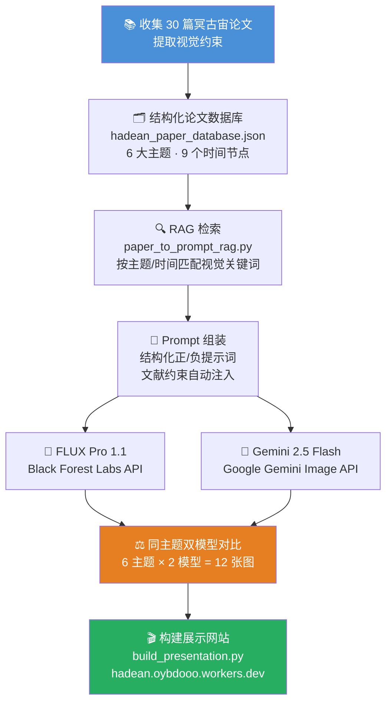

# Hadean Earth AI

使用生成式 AI 创作冥古宙（Hadean Eon）地球图像的项目。

## 展示网站

👉 **[https://hadean.oybdooo.workers.dev/](https://hadean.oybdooo.workers.dev/)**

## 课程信息

本项目是**张少兵**老师 **"早期地球和前寒武纪地质学"** 课程的第一次作业。

### 作业要求

> 请自己设计关键词或脚本，用不同的生成式AI生成冥古宙的地球照片，可以很宏观，也可以很具体。每个人至少试用两种AI工具，下次课前进行展示和讲述。

## Methods

### 整体流程图



### 工具链

```
paper_to_prompt_rag.py → batch_generate_images.py → build_presentation.py
```

### 6 个可视化主题

| 主题 | 时间 | 描述 |
|------|------|------|
| 🌍 宏观行星视角 | 4.2 Ga | 太空俯瞰：暗色原始洋壳、火山辉光、浓厚朦胧大气 |
| 🌊 原始海岸线 | 4.0 Ga | 黑色玄武岩海岸、暗色温暖海洋、硫化物大气 |
| ☄️ 陨石撞击事件 | 4.2 Ga | 巨型小行星撞击、蒸汽羽流、冲击波、撞击熔融物 |
| 🔥 热液喷口与生命起源 | 4.0 Ga | 深海黑烟囱/白烟囱、铁硫化物沉积 |
| 🔴 全球岩浆海洋 | 4.5 Ga | 炽热表面、暗色固化地壳碎片、浓厚蒸汽大气 |
| 🌙 温和的冥古宙 | 4.2 Ga | 挑战"地狱叙事"——厚云层下的暗色海洋与岩石岛屿 |

### 生成成本

| 工具 | 费用 | 说明 |
|------|------|------|
| FLUX Pro 1.1 | $10 | ~$0.055/张, 1440×960 |
| Gemini 2.5 Flash | ¥20 | 通过 NovAI 代理转发 |
| **总计** | **≈ ¥93** | 14 张图，平均 ¥6.6/张 |

### 关键思路

每张图像的 Prompt 并非凭空想象，而是由论文中提取的地质、大气、海洋等视觉特征**自动检索并拼装**而成。这是一个**文献驱动的推测性视觉重建**（Literature-informed Speculative Visualization）流程。

## 项目结构

```
├── gallery/                # 图片画廊配置
├── outputs/                # 生成结果
├── scripts/                # Prompt 生成脚本
├── training/               # LoRA 微调相关（数据、脚本、论文）
│   ├── data/               #   训练数据与标注
│   ├── scripts/            #   数据处理与训练脚本
│   ├── slurm/              #   HPC 集群提交脚本
│   └── manifests/          #   数据清单
├── presentation.html       # 展示幻灯片
├── build_presentation.py   # 构建展示的脚本
├── prompts.json            # Prompt 集合
└── 冥古宙AI展示方案.md       # 方案说明文档
```
